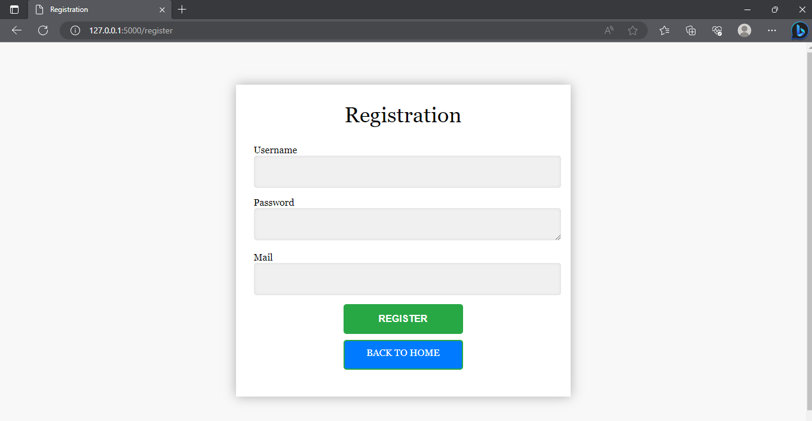
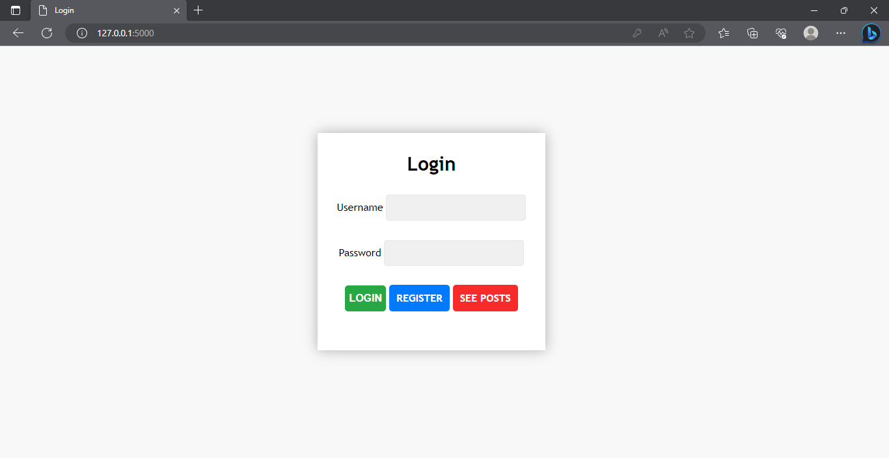
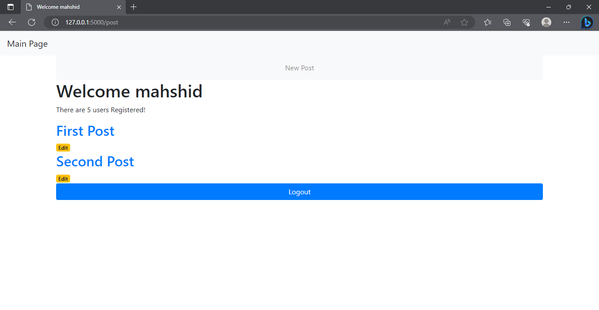
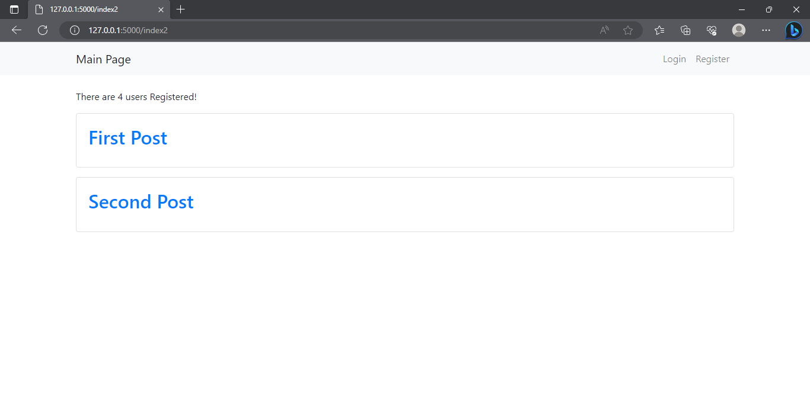
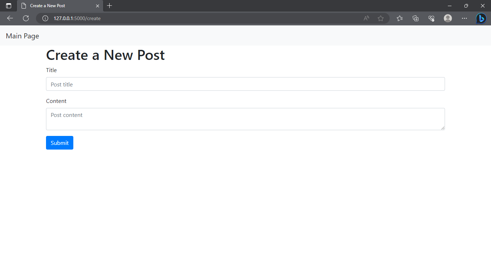
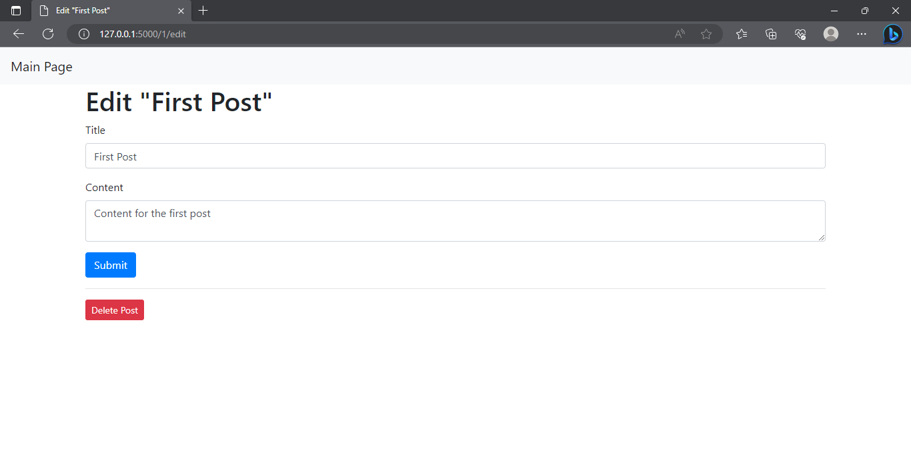

# simple-blog

### In this project, we designed a simple blog using HTML, CSS, JavaScript, Flask. This blog has the following features:
- Registration
* entry and exit
+ Display posts 
- Adding a new post
* Display the number of registered users

### In the following, we will explain each of these facilities: 
#### Part 1: Registration
In this section, the user enters his username, e-mail address and password, and if the registration is successful, he will be redirected to the login page, and if the registration is unsuccessful, he will stay on the same page.

#### Part 2: entry and exit
In this section, the user will enter the blog by entering his username and password. If the username and password of the user
stored in the database, successful login and the user will be directed to the main page, and in case of unsuccessful login, it will stay on the same page

#### Part 3: The main page
On the main page of the blog, you can see the posts that all users have registered. By clicking on each post, you can see the message in that post and the date and time when this post was published.
On this page, you can also see the number of users who have registered on the site, which is taken from the server by JavaScript and using FetchAPI.

**Attention:**
If the user is logged in the posts page will be shown like this:

If the user is **not** logged in the posts page will be shown like this:

#### Part 4 :Adding a new post
On this page, the logged in user can publish a post by choosing a name and writing the desired text. If the user is not logged into his account, this feature is not active for him!

#### User also can edit or delete a post:

